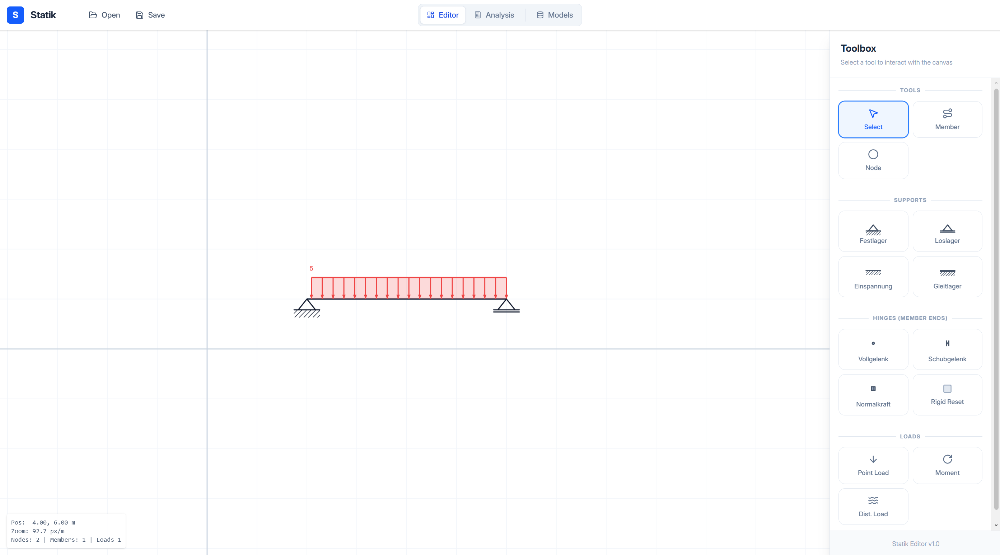
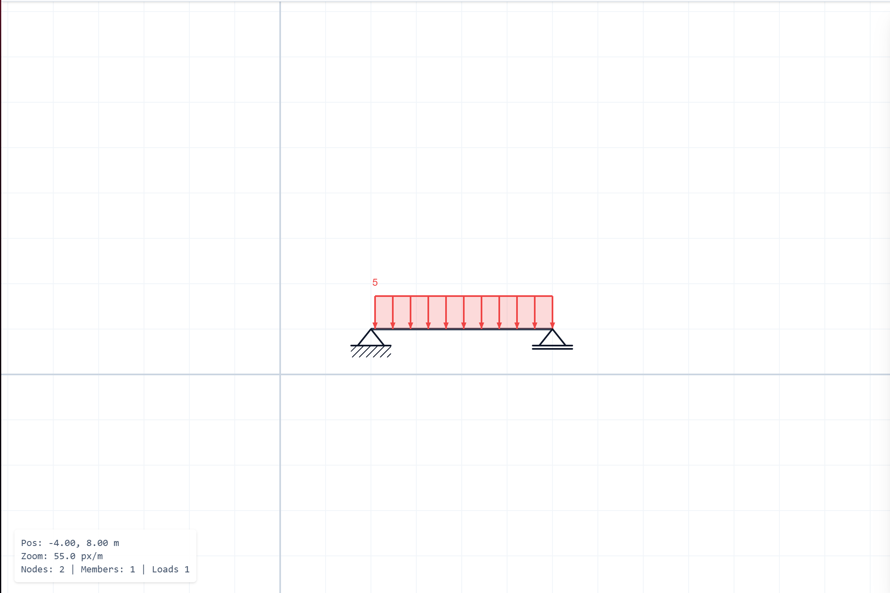
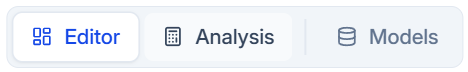
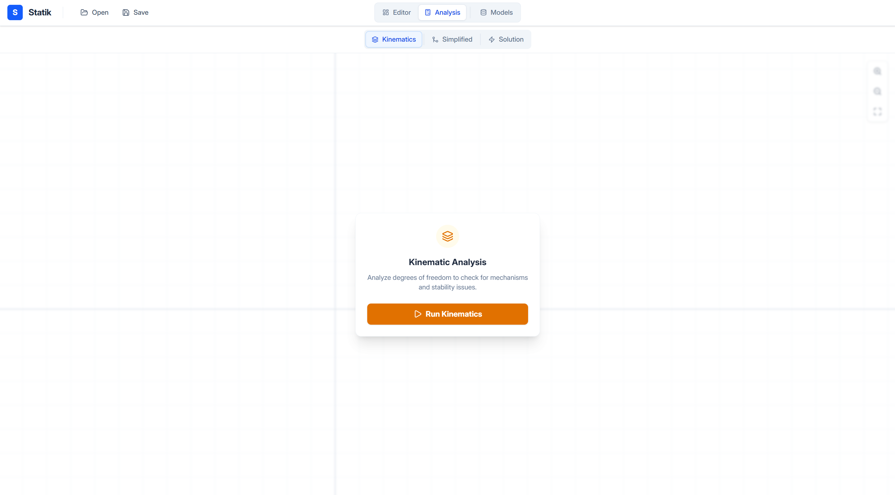
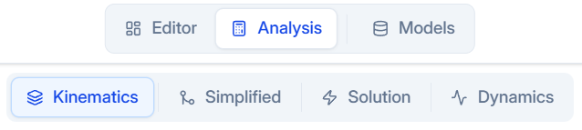
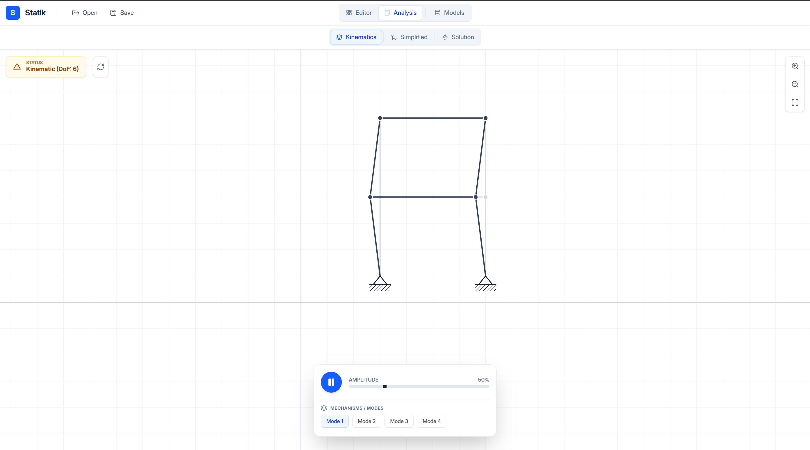
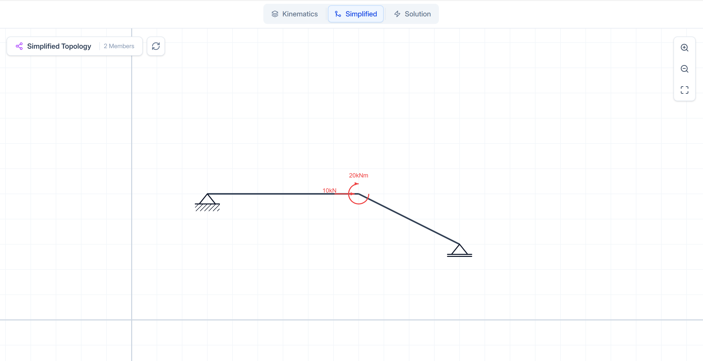
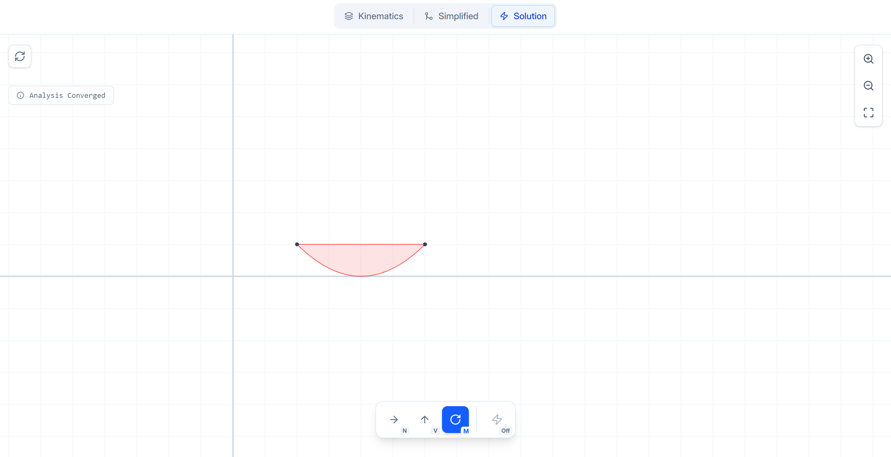
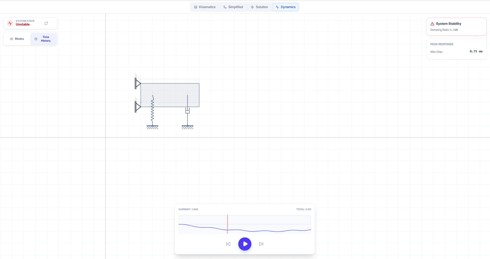
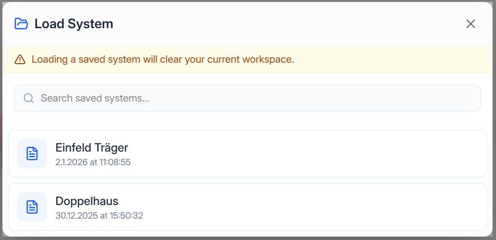

# Statik - Structural Analysis Editor

A structural analysis tool for civil engineering. Create, analyze, and visualize 2D structural systems with an intuitive interface.

<p align="center">
  
</p>

## Overview

Statik provides a complete workflow for structural analysis, from model creation to kinematic, static, and dynamic analysis. The application features a canvas-based editor with tooling for nodes, members, supports, hinges, loads, and rigid plate elements (Scheiben).

---

## Installation & Setup

Follow these steps to set up the development environment locally.

### Prerequisites

- **Python**: Version 3.9.13 or higher
- **Node.js**: Version 18+ (Recommended for Vite/React 19)
- **npm** (comes with Node.js)

### 1. Clone the Repository

```bash
git clone https://github.com/7Solomon/statik.git
cd statik
```
### Backend Setup (Python/Flask)
Navigate to the backend directory, create a virtual environment, and install dependencies.

```bash
cd backend

# Create virtual environment
python -m venv .venv
```

#### Activate virtual environment
```bash
# Windows (PowerShell):
.venv\Scripts\activate
```

```bash
# Linux/macOS:
source .venv/bin/activate
```

# Install dependencies
```bash
pip install -r requirements.txt
```

Note: Ensure you are using Python 3.9+. You can check your version with python --version.

### Frontend Setup (React/Vite)
Open a new terminal, navigate to the frontend directory, and install the Node modules.

```bash
cd frontend

# Install dependencies
npm install
```

### Running the Application
The project includes a unified script to run both the Backend (Flask) and Frontend (Vite) concurrently from the frontend directory.

**Development Mode**

Open your terminal in the frontend/ directory.

Run the development command:

```bash
npm run dev
```

This command uses concurrently to execute:

Backend: Flask server on http://127.0.0.1:8000

Frontend: Vite development server (usually http://localhost:5173)

Access the application in your browser at the Local URL provided by Vite.

## Core Features

### 📐 Editor Mode

Build structural models with precision using an interactive canvas workspace.

<p align="center">
  
</p>

#### Toolbox

The editor provides specialized tools for creating structural elements:

<p align="center">
  
</p>

**Basic Tools**
- **Select**: Interact with existing elements, pan and zoom the canvas
- **Node**: Create nodes with optional support conditions
- **Member**: Connect nodes to form structural members
- **Scheibe**: Create rigid or elastic plate elements (2D continuum regions)

**Support Types**
- **Festlager** (Fixed support): Constrains X and Y translation
- **Loslager** (Roller support): Constrains Y translation only
- **Einspannung** (Fixed end): Constrains X, Y translation and rotation
- **Gleitlager** (Sliding support): Constrains X translation and rotation

**Hinges (Member Ends)**
- **Vollgelenk** (Full hinge): Releases moment
- **Schubgelenk** (Shear hinge): Releases shear force
- **Normalkraftgelenk** (Axial hinge): Releases axial force
- **Rigid Reset**: Restore fully rigid connection

**Load Types**
- **Point Load**: Concentrated forces at nodes or along members
- **Moment**: Rotational loads
- **Distributed Load**: Uniform or varying loads along members
- **Dynamic Load**: Time-varying forces (Harmonic, Step, Pulse, Ramp) applied to nodes

**Scheiben (Plate Elements)**
- **RIGID**: Infinitely stiff plate regions that move as rigid bodies
- **ELASTIC**: Deformable continuum elements (requires meshing - future feature)
- Connect nodes to Scheiben for rigid body constraints or continuum coupling

---

### 📊 Analysis Mode

Switch from Editor to Analysis mode to solve and visualize your structural system.

<p align="center">
  
</p>

<p align="center">
  
</p>

#### Analysis Types

<p align="center">
  
</p>

**Available Analysis Methods:**
- **Kinematics**: Structural stability and mechanism detection
- **Simplified**: Simplified topology with equivalent member system
- **Solution**: Full finite element analysis with internal forces and deformations
- **Dynamics**: Time-history response and natural frequency analysis

#### Kinematic Analysis

Check degrees of freedom and validate structural stability before static analysis.

<p align="center">
  
</p>

The kinematic analysis identifies:
- Degree of freedom (DoF)
- Mechanisms and instabilities
- Rigid body motion of Scheiben
- System determinacy

**Scheiben in Kinematic Analysis**:
- RIGID Scheiben act as kinematic constraints, coupling connected nodes
- Mechanism modes show rigid body rotation and translation of Scheiben
- Nodes connected to Scheiben move together as a rigid unit

#### Simplified System View

Automatically generates simplified structural topology by identifying and consolidating rigid connections.

<p align="center">
  
</p>

This view shows:
- Equivalent member system
- Reduced node count
- Simplified load representation
- Scheiben preserved in simplified model

#### Solution Visualization (Statics)

View complete analysis results including:
- Internal force diagrams (Normal, Shear, Moment)
- Deformed shape (Not yet implemented)
- Scheiben displayed as constraint regions

<p align="center">
  
</p>

Toggle between different force components:
- **N**: Normal (axial) forces
- **V**: Shear forces  
- **M**: Bending moments
- **Off**: Hide diagrams

#### Dynamic Analysis

Perform time-dependent analysis of the structure to evaluate vibration, stability, and response to dynamic loads.

<p align="center">
  
</p>

**Features:**
- **Natural Frequencies**: Calculation of eigenvalues and eigenmodes
- **Time History**: Solve for Displacement, Velocity, and Acceleration over time
- **Energy**: Track Kinetic, Potential, and Dissipated energy
- **Signals**: Supports Harmonic, Pulse, Step, and Ramp input signals

---

### 💾 File Management

Save and load structural systems for later use.

<p align="center">
  
</p>

<p align="center">
  
</p>

**Features:**
- Save current workspace to browser storage
- Load previously saved systems
- Search through saved projects
- Timestamped project history

---

## Usage Workflow

1. **Create Structure**: Use the Editor mode to build your structural system
   - Place nodes and supports
   - Connect members
   - Add Scheiben for rigid regions
   - Define hinges at member ends
   - Apply loads (Static or Dynamic)

2. **Validate Kinematics**: Switch to Analysis → Kinematics to check stability
   - Verify the system is statically determinate or indeterminate
   - Identify any mechanisms
   - Check Scheibe rigid body motion

3. **Analyze Structure**: Run full structural analysis
   - **Static**: View simplified system topology, calculate internal forces, visualize moment/shear/normal diagrams
   - **Dynamic**: Define time range and timestep, simulate response to time-varying loads

4. **Save Your Work**: Store your structural models for future reference

---

## Technical Details

### Coordinate System

- **Convention**: Standard mathematical (counter-clockwise from +X axis)
  - 0° = Horizontal right
  - 90° = Vertical up
  - 180° = Horizontal left
  - -90° = Vertical down (gravity direction)

- **Units**: 
  - Force: kN (kilonewtons)
  - Moment: kNm (kilonewton-meters)
  - Length: meters
  - Time: seconds

### Analysis Methods

#### 1. Kinematic Analysis

The kinematic solver validates structural stability before performing static analysis using constraint-based methods.

**Degrees of Freedom**: Each node has 3 DOFs ($u, v, \theta$) representing horizontal displacement, vertical displacement, and rotation.

**Constraint Assembly**:
- **Support Constraints**: Fixed supports constrain translation and/or rotation based on support type. Rotated supports use transformation matrices to align local constraint directions with global axes.
- **Member Constraints**: 
  - Axial constraint prevents member length change unless axial releases exist at both ends.
  - Rotational constraints enforce compatibility between node rotations and member rigid body rotation based on hinge releases.
- **Scheibe Constraints**:
  - RIGID Scheiben enforce rigid body motion between all connected nodes.
  - Each Scheibe adds 3 constraints per connected node pair (compatibility in $u, v$, and $\theta$).
  - Scheibe-node connections can have releases (hinges) to allow relative rotation.

**Solution Method**: Singular Value Decomposition (SVD) of the constraint matrix identifies the null space, revealing kinematic modes (mechanisms) and degrees of freedom.

#### 2. System Simplification

The simplification algorithm reduces complex topologies while maintaining static equivalence.

**Cantilever Pruning**:
- Iteratively identifies and removes statically determinate branches (degree-1 nodes without supports).
- Transfers loads from removed nodes to parent nodes using force and moment equilibrium.
- Moment transfer accounts for position offset: $M_{root} = M_{tip} + \mathbf{r} \times \mathbf{F}$
- Nodes connected to Scheiben are protected from pruning (Scheibe acts as constraint).

#### 3. Finite Element Analysis (Statics)

The FEM solver implements 2D frame analysis with member releases, distributed loads, and rigid plate constraints.

**Element Formulation**:
- **Beam element**: 6 DOFs per element (3 per node: $u, v, \theta$).
- **Local stiffness matrix**: The implementation uses the standard Euler-Bernoulli formulation, combining axial stiffness ($EA/L$) and bending stiffness ($EI/L^3$):

$$
\mathbf{k}_{local} = \begin{bmatrix}
\frac{EA}{L} & 0 & 0 & -\frac{EA}{L} & 0 & 0 \\
0 & \frac{12EI}{L^3} & \frac{6EI}{L^2} & 0 & -\frac{12EI}{L^3} & \frac{6EI}{L^2} \\
0 & \frac{6EI}{L^2} & \frac{4EI}{L} & 0 & -\frac{6EI}{L^2} & \frac{2EI}{L} \\
-\frac{EA}{L} & 0 & 0 & \frac{EA}{L} & 0 & 0 \\
0 & -\frac{12EI}{L^3} & -\frac{6EI}{L^2} & 0 & \frac{12EI}{L^3} & -\frac{6EI}{L^2} \\
0 & \frac{6EI}{L^2} & \frac{2EI}{L} & 0 & -\frac{6EI}{L^2} & \frac{4EI}{L}
\end{bmatrix}
$$

- **Transformation**: Rotation matrix converts between local (member-aligned) and global coordinate systems.

**Scheibe Handling**:
- **RIGID Scheiben**: Treated as kinematic constraints using penalty method.
  - Penalty stiffness ($10^{12}$) couples connected nodes to enforce rigid body motion.
  - Constraint equations: $u_i = u_{ref} - dy \cdot \theta_{ref}$, $v_i = v_{ref} + dx \cdot \theta_{ref}$, $\theta_i = \theta_{ref}$.
  - Reference node chosen as first connection point.

**Solution**:
1. Assemble global stiffness matrix $\mathbf{K}$ and force vector $\mathbf{F}$.
2. Add Scheibe penalty constraints to $\mathbf{K}$.
3. Apply boundary conditions by modifying constrained DOF rows.
4. Solve $\mathbf{K} \mathbf{u} = \mathbf{F}$ for displacement vector $\mathbf{u}$.

#### 4. Dynamic Analysis

The dynamic solver performs a time history analysis of the system under time varying loads.

**Formulation**:
- Solves the equation of motion:
  
$$
\mathbf{M}\ddot{\mathbf{u}} + \mathbf{C}\dot{\mathbf{u}} + \mathbf{K}\mathbf{u} = \mathbf{F}(t)
$$

- **Mass Matrix ($\mathbf{M}$)**: Assembled from member masses (consistent or lumped) and Scheibe properties (thickness/density).
- **Stiffness Matrix ($\mathbf{K}$)**: Reused from the FEM formulation, including geometric stiffness from constraints.
- **Damping ($\mathbf{C}$)**: Explicit damping elements (dashpots) or proportional damping.

**Capabilities**:
- **Lagrangian Dynamics**: Fully coupled system equations.
- **Signals**: Supports harmonic oscillation, step functions, pulses, and linear ramps.
- **Energy Tracking**: Verification of conservation of energy (for conservative systems).

---

### Current Limitations

- **Load Placement**:
  - Dynamic loads (Force/Moment) can **only be placed on Nodes**. 
  - Distributed dynamic loads on Members are not yet supported.
  - Loads cannot be applied directly to Scheiben (must apply to a connected Node).

- **Rigid-body kinematics assumption**:  
  The kinematic analysis assumes axially rigid members. It only detects purely geometric mechanisms (motions without member deformation).

- **Mechanisms with double hinges**:  
  Systems with a node where *all* connected members have moment releases (double hinge situations) create a rotational mechanism. The software automatically detects these configurations and requires the user to designate a primary member before FEM analysis.

- **RIGID Scheiben (plate elements)**:  
  RIGID Scheiben are treated as infinitely stiff constraint elements in the FEM analysis. Connected nodes are coupled using penalty methods to enforce rigid body motion. Internal stresses and strains are not computed for these elements.

- **ELASTIC Scheiben not yet supported**:  
  ELASTIC Scheiben require full 2D continuum finite element meshing. This functionality is not yet implemented. ELASTIC Scheiben are currently ignored in analysis.

- **FEM on unstable systems**:  
  If the kinematic analysis finds $DOF > 0$, the global stiffness matrix becomes singular and the FEM solver cannot produce a valid solution.

- **Linear-elastic, small-deformation model**:  
  The FEM implementation assumes linear material behavior and small displacements/rotations. Geometric nonlinearity ($P-\Delta$ effects) and material nonlinearity are not modeled.

---

## Application Info

**Version**: v1.3

**Status**: Editor, Static Analysis, and Dynamic Analysis modules fully functional with RIGID Scheiben support
