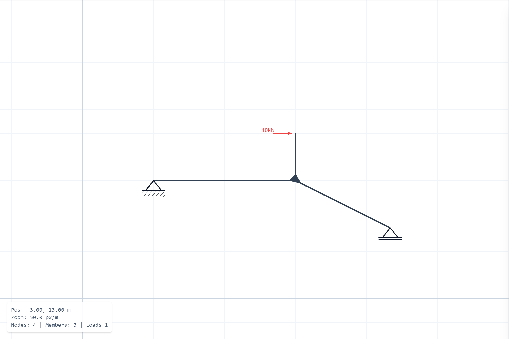

# Statik - Structural Analysis Editor

A structural analysis tool for civil engineering. Create, analyze, and visualize 2D structural systems with an nice interface.

  

## Overview

Statik provides a complete workflow for structural analysis, from model creation to kinematic and static analysis. The application features a canvas-based editor with tooling for nodes, members, supports, hinges, and loads.

---

## Core Features

### 📐 Editor Mode

Build structural models with precision using an interactive canvas workspace.

  

#### Toolbox

The editor provides specialized tools for creating structural elements:

  

**Basic Tools**
- **Select**: Interact with existing elements, pan and zoom the canvas
- **Node**: Create nodes with optional support conditions
- **Member**: Connect nodes to form structural members

**Support Types**
- **Festlager** (Fixed support): Constrains X and Y translation
- **Loslager** (Roller support): Constrains Y translation only
- **Einspannung** (Fixed end): Constrains X, Y translation and rotation
- **Gleitlager** (Sliding support): Constrains X translation and rotation

**Hinges (Member Ends)**
- **Vollgelenk** (Full hinge): Releases moment
- **Schubgelenk** (Shear hinge): Releases shear force
- **Normalkraftgelenk** (Axial hinge): Releases axial force
- **Rigid Reset**: Restore fully rigid connection

**Load Types**
- **Point Load**: Concentrated forces at nodes or along members
- **Moment**: Rotational loads
- **Distributed Load**: Uniform or varying loads along members

  

---

### 📊 Analysis Mode

Switch from Editor to Analysis mode to solve and visualize your structural system.

  

  

#### Analysis Types

  

**Available Analysis Methods:**
- **Kinematics**: Structural stability and mechanism detection
- **Simplified**: Simplified topology with equivalent member system
- **Solution**: Full finite element analysis with internal forces and deformations

#### Kinematic Analysis

Check degrees of freedom and validate structural stability before static analysis.

  

The kinematic analysis identifies:
- Degree of freedom (DoF)
- Mechanisms and instabilities
- System determinacy

#### Simplified System View

Automatically generates simplified structural topology by identifying and consolidating rigid connections.

  

This view shows:
- Equivalent member system
- Reduced node count
- Simplified load representation

#### Solution Visualization

View complete analysis results including:
- Internal force diagrams (Normal, Shear, Moment)
- Deformed shape (Not yet implemented)

  

Toggle between different force components:
- **N**: Normal (axial) forces
- **V**: Shear forces  
- **M**: Bending moments
- **Off**: Hide diagrams

  

---

### 💾 File Management

Save and load structural systems for later use.

  

  

**Features:**
- Save current workspace to browser storage
- Load previously saved systems
- Search through saved projects
- Timestamped project history

---

## Usage Workflow

1. **Create Structure**: Use the Editor mode to build your structural system
   - Place nodes and supports
   - Connect members
   - Define hinges at member ends
   - Apply loads

2. **Validate Kinematics**: Switch to Analysis → Kinematics to check stability
   - Verify the system is statically determinate or indeterminate
   - Identify any mechanisms

3. **Analyze Structure**: Run full structural analysis
   - View simplified system topology
   - Calculate internal forces and deformations
   - Visualize moment, shear, and normal force diagrams

4. **Save Your Work**: Store your structural models for future reference

---

## Technical Details

### Coordinate System

- **Convention**: Standard mathematical (counter-clockwise from +X axis)
  - 0° = Horizontal right
  - 90° = Vertical up
  - 180° = Horizontal left
  - -90° = Vertical down (gravity direction)

- **Units**: 
  - Force: kN (kilonewtons)
  - Moment: kNm (kilonewton-meters)
  - Length: meters

### Analysis Methods

#### 1. Kinematic Analysis

The kinematic solver validates structural stability before performing static analysis using constraint-based methods.

**Degrees of Freedom**: Each node has 3 DOFs (u, v, θ) representing horizontal displacement, vertical displacement, and rotation.

**Constraint Assembly**:
- **Support Constraints**: Fixed supports constrain translation and/or rotation based on support type. Rotated supports use transformation matrices to align local constraint directions with global axes.
- **Member Constraints**: 
  - Axial constraint prevents member length change unless axial releases exist at both ends
  - Rotational constraints enforce compatibility between node rotations and member rigid body rotation based on hinge releases

**Solution Method**: Singular Value Decomposition (SVD) of the constraint matrix identifies the null space, revealing kinematic modes (mechanisms) and degrees of freedom.

**Output**: 
- Total degrees of freedom
- Node velocity vectors for each mechanism
- Instantaneous centers of rotation (poles) for each member

#### 2. System Simplification

The simplification algorithm reduces complex topologies while maintaining static equivalence.

**Cantilever Pruning**:
- Iteratively identifies and removes statically determinate branches (degree-1 nodes without supports)
- Transfers loads from removed nodes to parent nodes using force and moment equilibrium
- Moment transfer accounts for position offset: \( M_{root} = M_{tip} + \mathbf{r} \times \mathbf{F} \)

**Rigid Body Detection**:
- Calculates instantaneous center of rotation (pole) for each member from nodal velocities
- Groups members with coincident poles (within tolerance) into rigid bodies
- Identifies translation-dominated regions where members move as a unit

#### 3. Finite Element Analysis

The FEM solver implements 2D frame analysis with member releases and distributed loads.

**Element Formulation**:
- **Beam element**: 6 DOFs per element (3 per node: u, v, θ)
- **Local stiffness matrix**: Combines axial stiffness \( EA/L \) and bending stiffness terms with \( EI/L^3 \)
- **Transformation**: Rotation matrix converts between local (member-aligned) and global coordinate systems

**Release Handling**:
- **Static condensation**: Reduces stiffness matrix by eliminating DOFs at hinged connections
- For moment releases at member ends, the rotational stiffness is removed while maintaining force equilibrium

**Load Processing**:
- **Nodal loads**: Point forces and moments applied directly to global force vector after angle-to-component conversion
- **Distributed loads**: Converted to equivalent nodal forces using fixed-end moment formulas:
  - Uniform load: \( R = wL/2 \), \( M = wL^2/12 \)
  - Point load on beam: Position-dependent reactions using cubic influence functions

**Solution**:
1. Assemble global stiffness matrix \( \mathbf{K} \) and force vector \( \mathbf{F} \)
2. Apply boundary conditions by modifying constrained DOF rows
3. Solve \( \mathbf{K} \mathbf{u} = \mathbf{F} \) for displacement vector \( \mathbf{u} \)
4. Back-calculate member forces from \( \mathbf{f} = \mathbf{K}_{local} \mathbf{u}_{local} + \mathbf{f}_{fixed} \)

**Post-Processing**:
- Internal forces sampled at 21 stations along each member
- Superposition of reaction forces and applied load effects
- Min/max values tracked for visualization scaling

---

### Current Limitations

- **Rigid-body kinematics assumption**:  
  The kinematic analysis assumes axially rigid members. It only detects purely geometric mechanisms (motions without member deformation) and does not account for stabilization by axial flexibility or geometric stiffness effects.

- **Mechanisms with double hinges**:  
  Systems with a node where *all* connected members have moment releases (double hinge situations) are treated as mechanisms. Such configurations will report a positive degree of freedom and should not be analyzed with FEM until at least one member is made rotationally fixed at that node.

- **FEM on unstable systems**:  
  If the kinematic analysis finds DOF > 0, the global stiffness matrix becomes singular and the FEM solver cannot produce a valid solution. In this case the analysis will fail with an instability / singular-matrix error and the structure must be stabilized (supports or releases adjusted).

- **Linear-elastic, small-deformation model**:  
  The FEM implementation assumes linear material behavior and small displacements/rotations. Geometric nonlinearity (P–Δ / P–δ effects, large rotations) and material nonlinearity (plastic hinges, cracking, etc.) are not modeled.

- **2D frames only**:  
  Analysis is limited to planar frame systems with 3 DOFs per node (u, v, θ). 3D effects, torsion about the member axis, and out-of-plane behavior are not included.

## Application Info

**Version**: v1.0  
**Status**: Editor and Analysis modules fully functional

