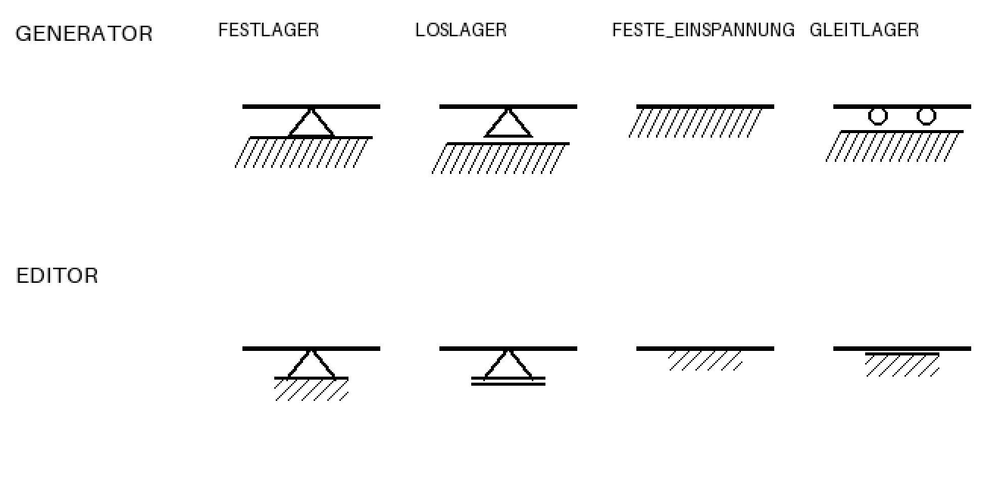

# Datensatz reparieren: Symbole, Klassenprior, Bemassung

Aus der Messung in Etappe 2b (siehe `agent-integration-plan.md`). Drei
voneinander unabhaengige Probleme, drei getrennte Eingriffe. Alle drei treffen
den Agenten *und* das YOLO-Training — das ist der Grund, sie vor Etappe 3 zu
erledigen.

---

## 1. Befund: drei Meinungen ueber dieselben Symbole



Oben, wie `StanliSupport._ops` zeichnet; unten, was
`frontend/app/assets/support_symbols.json` fuer denselben Lagertyp zeichnet.
(Dreifach vergroessert, Pixel fuer Pixel — `assets/symbols-true-size.png`
zeigt die Originalgroesse.)

| Lager | Generator | Editor |
|---|---|---|
| Festlager | Dreieck, Linie anliegend, Schraffur | dasselbe |
| **Loslager** | Dreieck, Linie **4 px tiefer**, Schraffur | Dreieck, **Doppellinie ohne Schraffur** |
| Feste Einspannung | schraffierte Linie | dasselbe |
| **Gleitlager** | **zwei Kreise** + Linie + Schraffur | **Doppellinie + Schraffur** |

Zwei echte Widersprueche:

**Loslager.** Der Generator setzt Festlager und Loslager beide auf eine
schraffierte Grundlinie und unterscheidet sie nur ueber `supportGap = 1.0` mm,
bei `PX_PER_MM = 4.0` also **4 Pixel**. Der Kommentar im Code sagt das selbst:
*"That gap is the only discriminator between the two."* Unter einer Schraffur,
die den ganzen Bereich fuellt, ist eine 4-px-Verschiebung praktisch nicht
sichtbar — und nach dem Herunterskalieren auf `imgsz=640` erst recht nicht.
Der Editor loest es besser: **Doppellinie statt Schraffur**. Das ist ein
Unterschied in der *Art* der Zeichnung, nicht in vier Pixeln, und er ueberlebt
jede Skalierung.

**Gleitlager.** Der Generator zeichnet Rollen. In der ueblichen deutschen
Konvention lesen sich Rollen als Loslager — daher kam in der Messung die
Haelfte aller Lagerverwechslungen. Fachlich ist `gleitlager` hier
`{fixN: true, fixV: false, fixM: true}`, also eine **Parallelfuehrung /
Schiebehuelse**, und genau die zeichnet der Editor: Doppellinie mit Schraffur.
Der Generator zeichnet das falsche Bauteil.

---

## 2. Befund: die Klassenverteilungen widersprechen sich

Handlabels aus echtem Material (`content/labeling/harvest-images/annotations`,
495 Boxen) gegen 200 generierte Systeme:

| Lager | real | synthetisch | Faktor |
|---|---|---|---|
| Loslager | 38,3 % | 24,9 % | 0,7 |
| Festlager | 31,3 % | 42,4 % | 1,4 |
| Feste Einspannung | 28,4 % | **6,5 %** | **0,2** |
| Gleitlager | **2,0 %** | **26,2 %** | **13** |

| Gelenk | real | synthetisch | Faktor |
|---|---|---|---|
| Vollgelenk | 91,4 % | 66,4 % | 0,7 |
| Schubgelenk | 5,3 % | 14,8 % | 2,8 |
| Normalkraftgelenk | 2,6 % | 18,9 % | **7** |

Die Ursache beim Gleitlager steht in einer Zeile
(`structure_generator.py`, `_ground_support`):

```python
choices = [SupportType.LOSLAGER]
if allow_gleitlager:
    choices.append(SupportType.GLEITLAGER)
return random.choice(choices)
```

Jedes Lager ausser dem ersten ist also mit 50 % ein Gleitlager — das im
echten Material 4-mal in 495 Boxen vorkommt. Ein Detektor lernt daraus einen
Prior, der um mehr als eine Groessenordnung falsch ist.

---

## 3. Eingriff A — Symbolvokabular vereinheitlichen

**Der Editor ist die richtige Vorlage**, nicht der Generator: seine Symbole
sind die konventionellen, und der Nutzer sieht sie ohnehin beim Zeichnen.

In `stanli_symbols.py`, `StanliSupport._ops`:

* `LOSLAGER`: Dreieck wie bisher, darunter **zwei parallele Linien, keine
  Schraffur**. Abstand proportional zur Dreieckshoehe (der Editor nimmt 4 auf
  20, also 20 %).
* `GLEITLAGER`: die Kreise ersetzen durch **Doppellinie + Schraffur**.
* Neue Konstanten `supportRollerGap`, `supportSliderGap` statt der
  Doppelbelegung von `supportGap`.

**Was dabei nicht bricht:** die YOLO-Boxen. `get_bbox` und `get_corners` leiten
beide aus `_ops` ab (`_obb_from_ops(self._ops(...))`), und `compute_placements`
ist die gemeinsame Quelle fuer Zeichnung und Label. Die Boxen wandern also
automatisch mit — genau das, wofuer diese Kopplung gebaut wurde.

**Was bricht:** die vorhandenen synthetischen Datensaetze unter
`content/datasets/*` zeigen dann alte Symbole. Neu generieren, das kostet
nichts. Die **Handlabels auf echten Bildern sind nicht betroffen** — die
beschriften reale Zeichnungen, die sich nicht aendern.

### Pruefung: ein Trennbarkeitstest

Der eigentliche Gewinn ist, dass sich "sind diese Klassen unterscheidbar"
automatisieren laesst. Ein Test, der jedes Paar aus `detectable_class_names()`
bei **Trainingsaufloesung** rastert und einen Mindestunterschied verlangt:

```
fuer jedes Klassenpaar (a, b):
    rastere beide Symbole in dieselbe Kachel, skaliert wie imgsz=640
    verlange, dass sich die Tintenmasken um mindestens X % unterscheiden
```

Damit faellt eine kuenftige Symbolaenderung, die zwei Klassen wieder
zusammenfallen laesst, sofort auf — statt erst nach einem Trainingslauf in
der Konfusionsmatrix. Der aktuelle Zustand (Festlager/Loslager) wuerde diesen
Test heute nicht bestehen; das ist der Punkt.

---

## 4. Eingriff B — Klassenprior an die Realitaet heranfuehren

Zwei getrennte Fragen, die man nicht vermischen sollte.

**Fuer die Auswertung** soll die Verteilung der echten entsprechen, sonst misst
man an einer Welt, die es nicht gibt.

**Fuer das Training** ist die reale Verteilung *nicht* automatisch die beste.
Eine Klasse mit 2 % Anteil bekommt zu wenige positive Beispiele, um gelernt zu
werden. Ueblich und richtig ist: im Training ueber-, im Validierungssatz
realistisch abtasten.

Konkret:

* `DatasetConfig` bekommt `support_weights` und `hinge_weights`.
* `_ground_support` zieht daraus statt aus `random.choice`.
* Trainingsvorgabe etwa: Loslager 40 %, Festlager 25 %, Einspannung 25 %,
  Gleitlager 10 % — Einspannung deutlich hoch (real 28 %, synthetisch 6,5 %),
  Gleitlager deutlich runter, aber nicht auf 2 %, sonst ist es unlernbar.
* Validierungssatz mit den realen Gewichten erzeugen und die mAP **dort**
  ablesen.

Ein Hilfsskript `scripts/label_stats.py`, das die Verteilung aus
`content/labeling/*/annotations/*.txt` ausrechnet, macht diese Gewichte
nachpruefbar statt geraten — und zeigt, wenn neue Handlabels das Bild
verschieben.

**Alternative fuer das Gleitlager:** ganz aus `DETECTABLE_SUPPORTS` nehmen. Der
Code kennt dieses Muster schon — FEDER und TORSIONSFEDER stehen mit
Begruendung drin, HALBGELENK und BIEGESTEIFE_ECKE ebenso. Dann darf der
Generator es aber auch nicht mehr *zeichnen*, sonst lernt das Modell, ein Lager
zu ignorieren. Ich wuerde es behalten: mit dem korrigierten Symbol aus
Eingriff A ist es unterscheidbar, und der Editor bietet den Typ ohnehin an.

---

## 5. Eingriff C — Bemassung mit echten Zahlen

Loest zwei Dinge auf einmal.

**Das Problem.** `AnnotationRenderer._dimension_line` erfindet die Laenge:

```python
metres = round((x1 - x0) / self.rng.uniform(55.0, 95.0), 2)
```

Fuer Trainings-Beiwerk ist das richtig — Text soll gelernt werden zu
ignorieren. Fuer die Auswertung ist es unbrauchbar, und fuer den realistischen
Agenten-Weg ("lies die Bemassung ab") ebenfalls: dieser Weg laesst sich am
aktuellen Datensatz gar nicht pruefen.

**Der Eingriff.** `RenderStyle` bekommt eine Quelle fuer die Bemassung:
`"erfunden"` (heutiges Verhalten) oder `"echt"`. Fuer `"echt"` braucht die
`ImageSystem` eine Spannweite — der Generator wuerfelt eine plausible
(4-20 m) und legt sie an. Gezeichnet wird dann eine **Bemassungskette** ueber
die tatsaechlichen Knotenabstaende, mit den wahren Werten.

**Warum das der wertvollste der drei Eingriffe ist:** eine Bemassungskette
markiert jeden Knoten. Damit verschwindet das Identifizierbarkeitsproblem aus
der Messung — ein Knoten mitten im geraden Stabzug hinterlaesst heute keine
Spur im Bild (`compare.unobservable_nodes` misst das), mit einer Masskette
schon. Und sie macht den Massstab lesbar, also genau den Weg pruefbar, auf dem
der ganze Plan aufbaut.

Fuer YOLO ist das eher besser als schlechter: echte Uebungsblaetter sind
bemasst, und die Zahlen stehen dort in echter Beziehung zur Zeichnung.

---

## 6. Reihenfolge

1. **A** (Symbole) — blockiert alles andere, weil jede Messung davor die
   Zeichnung misst und nicht den Leser. Dazu der Trennbarkeitstest.
2. **C** (Bemassung) — hebt die Obergrenze der Messaufgabe und macht den
   eigentlichen Agenten-Weg pruefbar.
3. **B** (Prior) — billig, aber erst sinnvoll, wenn die Symbole stehen.
4. Eval neu erzeugen und messen. Die heutigen Zahlen sind die Vergleichsbasis:
   Topologie 6/8, Lager 0,71, Gelenke 0,67, komplett korrekt 0/8.
5. Erst danach YOLO neu trainieren und die Konfusionsmatrix ansehen. Die
   Frage "brauchen wir den Detektor ueberhaupt" ist vorher nicht beantwortbar.
